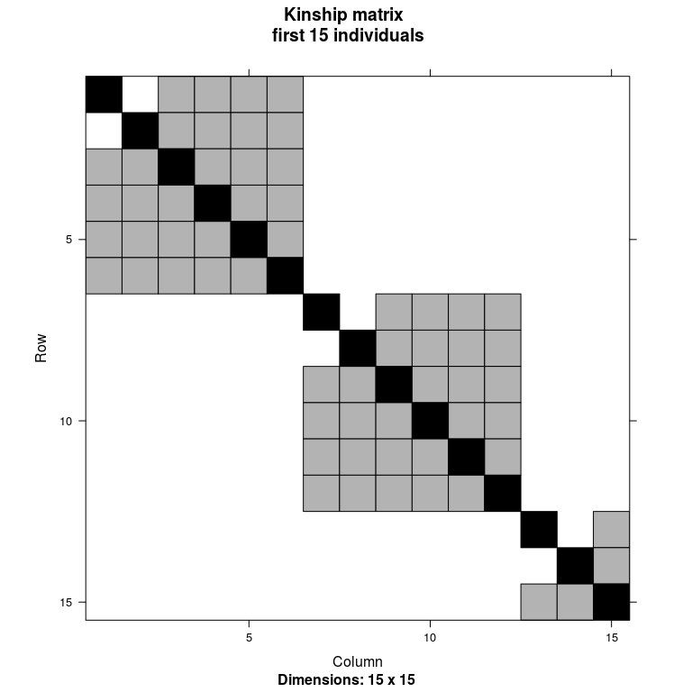
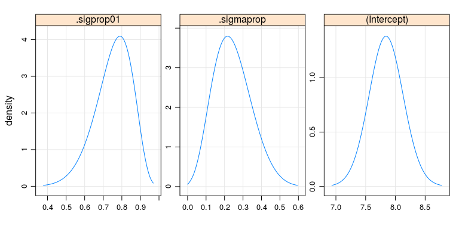

<!-- README.md is generated from README.Rmd. Please edit that file -->
lme4qtl
=======

<!-- badges: start -->
[](https://travis-ci.org/variani/lme4qtl) <!-- badges: end -->

`lme4qtl` extends the [lme4](https://github.com/lme4/lme4) R package for quantitative trait locus (qtl) mapping. It is all about the covariance structure of random effects. `lme4qtl` supports user-defined matrices for that, e.g. kinship or IBDs.

See slides [bit.ly/1UiTZvQ](http://bit.ly/1UiTZvQ) introducing the `lme4qtl` R package or read our [article](http://dx.doi.org/10.1186/s12859-018-2057-x) / [preprint](http://www.biorxiv.org/content/early/2017/08/31/139816).

<table style="width:46%;">
<colgroup>
<col width="15%" />
<col width="30%" />
</colgroup>
<thead>
<tr class="header">
<th>Package</th>
<th>Continuous response</th>
</tr>
</thead>
<tbody>
<tr class="odd">
<td>stats</td>
<td><code>lm(myTrait ~ myCovariate, myData)</code></td>
</tr>
<tr class="even">
<td>lme4</td>
<td><code>lmer(myTrait ~ myCovariate + (1\|myID), myData)</code></td>
</tr>
<tr class="odd">
<td>lme4qtl</td>
<td><code>relmatLmer(myTrait ~ myCovariate + (1\|myID), myData, relmat = list(myID = myMatrix))</code></td>
</tr>
</tbody>
</table>

<table style="width:46%;">
<colgroup>
<col width="15%" />
<col width="30%" />
</colgroup>
<thead>
<tr class="header">
<th>Package</th>
<th>Binary response</th>
</tr>
</thead>
<tbody>
<tr class="odd">
<td>stats</td>
<td><code>glm(myStatus ~ 1, myData, family = binomial)</code></td>
</tr>
<tr class="even">
<td>lme4</td>
<td><code>glmer(myStatus ~ (1\|myID), myData, family = binomial)</code></td>
</tr>
<tr class="odd">
<td>lme4qtl</td>
<td><code>relmatGlmer(myStatus ~ (1\|myID), myData, relmat = list(myID = myMatrix), family = binomial)</code></td>
</tr>
</tbody>
</table>

Note that rownames/colnames of `myMatrix` have to be values of `myID` variable, so matching between relationship matrix and grouping variable is possible. The order doesn't matter.

Installation
------------

You can install the development version from [GitHub](https://github.com/variani/lme4qtl) with:

``` r
# install.packages("devtools")
devtools::install_github("variani/lme4qtl")
```

The official release on [CRAN](https://CRAN.R-project.org) is [pending](https://github.com/variani/lme4qtl/issues/9).

Example
-------

``` r
library(lme4)
library(lattice)
```

``` r
library(lme4qtl)
```

``` r
packageVersion("lme4qtl")
#> [1] '0.2.1'
```

Load simulated data, phenotypes `dat40` and the kinship matrix `kin2`.

``` r
data(dat40, package = "lme4qtl")
head(dat40)
#>     ID  trait1  trait2 AGE FAMID  FA  MO SEX trait1bin trait2bin
#> 7  101 8.41954 9.67925  50    10   0   0   1         0         0
#> 14 102 5.47141 4.31886  44    10   0   0   2         0         0
#> 21 103 9.66547 7.00735  34    10 101 102   2         0         0
#> 28 104 6.27092 8.59257  41    10 101 102   1         0         0
#> 35 105 7.96814 7.60801  36    10 101 102   1         0         0
#> 42 106 8.29865 8.17634  37    10 101 102   2         0         0
Matrix::image(kin2[1:15, 1:15], main = "Kinship matrix \n first 15 individuals")
```



Fit a model for continuous trait with two random effects, family-grouping `(1|FAM)` and additive genetic `(1|ID)`.

``` r
m1 <- relmatLmer(trait1 ~ AGE + SEX + (1|FAMID) + (1|ID), dat40, relmat = list(ID = kin2))
#> boundary (singular) fit: see ?isSingular
#> boundary (singular) fit: see ?isSingular
m1
#> Linear mixed model fit by REML ['lmerMod']
#> Formula: trait1 ~ AGE + SEX + (1 | FAMID) + (1 | ID)
#>    Data: dat40
#> REML criterion at convergence: 963.3853
#> Random effects:
#>  Groups   Name        Std.Dev.
#>  ID       (Intercept) 2.2988  
#>  FAMID    (Intercept) 0.0000  
#>  Residual             0.7856  
#> Number of obs: 224, groups:  ID, 224; FAMID, 39
#> Fixed Effects:
#> (Intercept)          AGE         SEX2  
#>    7.563248     0.008314    -0.364197  
#> convergence code 0; 1 optimizer warnings; 0 lme4 warnings
```

Get an estimate of heritability, the proportion of variance explained by `(1|ID)`.

``` r
lme4::VarCorr(m1)
#>  Groups   Name        Std.Dev.
#>  ID       (Intercept) 2.29880 
#>  FAMID    (Intercept) 0.00000 
#>  Residual             0.78562
lme4qtl::VarProp(m1)
#>        grp        var1 var2      vcov     sdcor      prop
#> 1       ID (Intercept) <NA> 5.2845002 2.2988041 0.8954191
#> 2    FAMID (Intercept) <NA> 0.0000000 0.0000000 0.0000000
#> 3 Residual        <NA> <NA> 0.6172059 0.7856245 0.1045809
```

Profile the variance components to get the 95% confidence intervals. The function `profile` is implemented in lme4.

``` r
m2 <- relmatLmer(trait2 ~ (1|ID), dat40, relmat = list(ID = kin2)) 

prof <- profile(m2)
#> Warning in zetafun(np, ns): NAs detected in profiling
prof_prop <- lme4qtl::varpropProf(prof) # convert variance components to proportions
confint(prof_prop)
#>                 2.5 %    97.5 %
#> .sigprop01  0.5292158 0.9157910
#> .sigmaprop  0.0655726 0.4652175
#> (Intercept) 7.2745157 8.4237085
```

``` r
densityplot(prof)
```


``` r
densityplot(prof_prop)
```



``` r

try(splom(prof)) 
#> Error in if (singfit) warning("splom is unreliable for singular fits") : 
#>   missing value where TRUE/FALSE needed
```

Fit a model for binary trait.

``` r
m3 <- relmatGlmer(trait1bin ~ (1|ID), dat40, relmat = list(ID = kin2), family = binomial)
m3
#> Generalized linear mixed model fit by maximum likelihood (Laplace
#>   Approximation) [glmerMod]
#>  Family: binomial  ( logit )
#> Formula: trait1bin ~ (1 | ID)
#>    Data: dat40
#>      AIC      BIC   logLik deviance df.resid 
#> 175.5894 182.5000 -85.7947 171.5894      232 
#> Random effects:
#>  Groups Name        Std.Dev.
#>  ID     (Intercept) 51.09   
#> Number of obs: 234, groups:  ID, 234
#> Fixed Effects:
#> (Intercept)  
#>      -27.88
```

Citation
--------

To cite the `lme4qtl` package in publications use:

      Ziyatdinov et al., lme4qtl: linear mixed models with flexible
      covariance structure for genetic studies of related individuals, 
      BMC Bioinformatics (2018)

Contact
-------

You are welcome to submit suggestions and bug-reports at <https://github.com/variani/lme4qtl/issues>.
